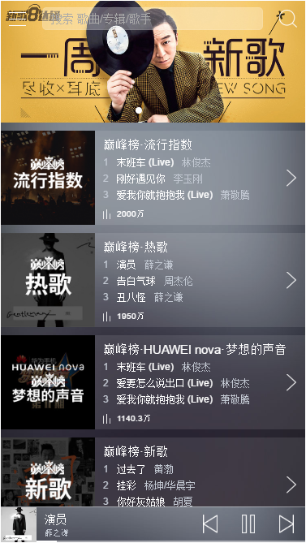
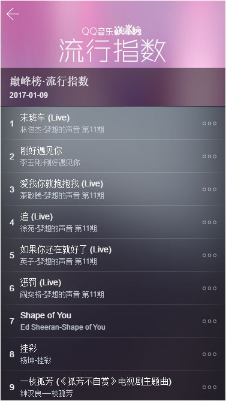
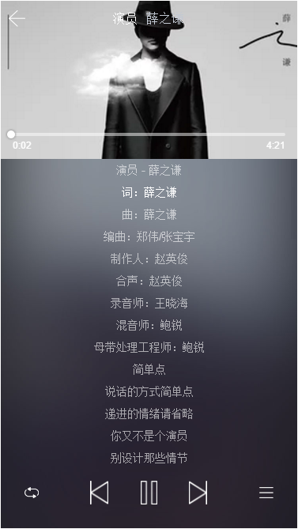
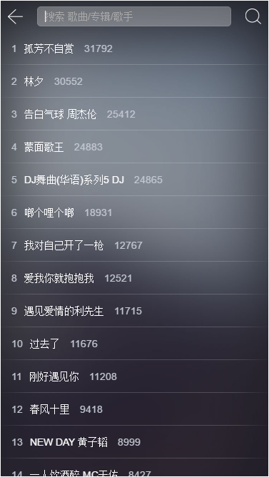
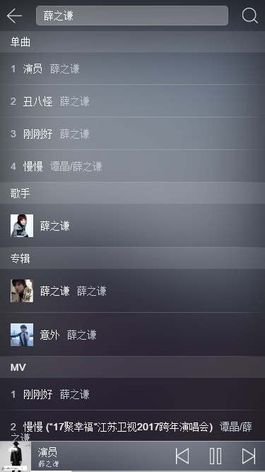
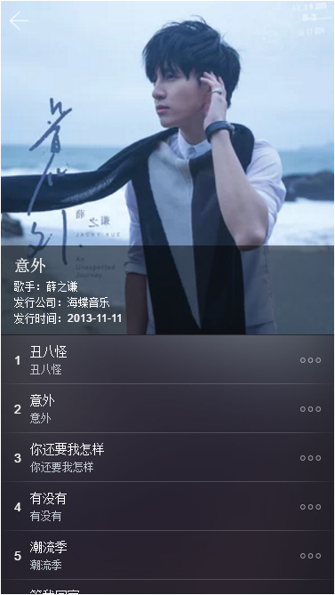
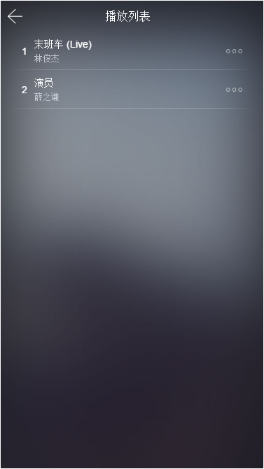

# vue-music

> 最近在学vue，在掘金上看到一篇好帖子，实现的音乐播放器，心血来潮，自己也写了个~~~

## 实现的功能：
1. 排行榜
2. 轮播图展示
3. 搜索推荐
4. 搜索歌曲
5. 搜索专辑
6. 搜索歌手
7. 上一曲，下一曲，播放暂停
8. 随机播放，循环播放，单曲播放
9. 加入/删除播放列表，
10. 查看专辑
11. 查看歌手

## UI图

